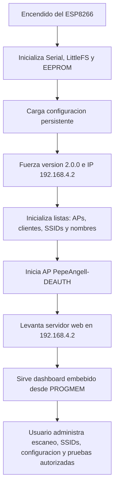

# ESP8266-DEAUTHER

Firmware personalizado para ESP8266 con interfaz web, pantalla OLED y panel de control para pruebas de laboratorio en redes WiFi propias. Esta version esta adaptada con identidad visual PEPEANGELL, dashboard oscuro, idioma espanol por defecto y acceso web unificado en `192.168.4.2`.

> Este proyecto esta pensado para investigacion, aprendizaje y pruebas autorizadas. No debe usarse contra redes, dispositivos o personas sin permiso explicito.

## Vista General


## Caracteristicas

- Firmware para ESP8266 / NodeMCU basado en Arduino.
- Punto de acceso propio para administrar el dispositivo.
- Dashboard web embebido en memoria del firmware.
- Interfaz oscura con acentos verdes y naranjas.
- Pantalla OLED SSD1306 con menu local.
- Escaneo de puntos de acceso y clientes visibles.
- Administracion de SSID para pruebas beacon/probe en laboratorio.
- Panel de control para pruebas WiFi autorizadas.
- Configuracion persistente en EEPROM.
- Archivos web comprimidos y embebidos en `webfiles.h`.
- Version personalizada: `2.0.0`.

## Acceso al Dashboard

Al encender el dispositivo, se crea un AP para administrar el firmware.

| Dato | Valor |
| --- | --- |
| AP | `PepeAngell-DEAUTH` |
| Password | `123456789` |
| IP web | `http://192.168.4.2` |
| Version | `2.0.0` |
| Web URL interna | `pepeangell.dev` |

El firmware fuerza la IP del AP y la interfaz web a `192.168.4.2`, incluso si existia una configuracion anterior guardada en EEPROM.

## Galeria del Dashboard

### Aviso de Uso


### Escaner


### Clientes Detectados


### SSID / Beacons


### Panel de Pruebas


### Configuracion


## Flujo de Funcionamiento



## Modulos Principales del Firmware

| Archivo | Funcion |
| --- | --- |
| `ESP8266_Deauther_SSD1306.ino` | Punto de entrada del firmware, inicializacion general y ciclo principal. |
| `A_config.h` | Configuracion base: AP, password, IP, pantalla, version y opciones del firmware. |
| `wifi.cpp` / `wifi.h` | AP, DNS, servidor web, rutas HTTP y entrega del dashboard embebido. |
| `settings.cpp` / `settings.h` | Carga, guardado y normalizacion de configuracion persistente. |
| `Scan.cpp` / `Scan.h` | Escaneo de puntos de acceso y clientes. |
| `Accesspoints.*` | Modelo/lista de puntos de acceso detectados. |
| `Stations.*` | Modelo/lista de clientes detectados. |
| `SSIDs.*` | Lista de SSID personalizados para pruebas controladas. |
| `Attack.*` | Control interno de pruebas WiFi autorizadas. |
| `DisplayUI.*` | Menu local en pantalla OLED. |
| `CLI.*` | Interfaz de comandos por serial/web. |
| `webfiles.h` | HTML, CSS, JS e idiomas comprimidos y embebidos en el firmware. |
| `data/web/` | Fuentes web comprimidas que se usan para regenerar `webfiles.h`. |

## Dashboard Web

El dashboard esta dividido en secciones principales:

- **Aviso de uso:** pantalla inicial con confirmacion antes de entrar al panel.
- **Scan:** escaneo de APs y clientes visibles en el entorno de pruebas.
- **SSIDs:** administracion de nombres SSID para escenarios controlados.
- **Attack:** panel de estado para pruebas WiFi autorizadas y monitoreo de paquetes.
- **Settings:** configuracion del AP, parametros internos, idioma, pantalla y opciones persistentes.

La interfaz fue modificada para cargar en espanol, usar fondo negro, botones verdes/naranjas, checks de alto contraste y footer personalizado con redes PEPEANGELL.

## Detalles Tecnicos de la Web

- Los archivos web viven en `data/web/`.
- Los archivos se almacenan comprimidos como `.gz`.
- `webfiles.h` contiene los mismos archivos como arreglos PROGMEM.
- El firmware sirve la web nueva desde PROGMEM para evitar que LittleFS muestre versiones anteriores.
- Las cabeceras HTTP usan `no-cache` para evitar que el navegador conserve la interfaz vieja.

## Compilacion

Este proyecto usa PlatformIO.

```bash
pio run
```

Para subir al ESP8266, ajusta el puerto serial segun tu equipo:

```bash
pio run -t upload --upload-port COM7
```

Configuracion actual de PlatformIO:

```ini
[env:nodemcuv2]
platform = espressif8266@2.6.3
board = nodemcuv2
framework = arduino
monitor_speed = 115200
upload_speed = 115200
lib_ldf_mode = deep+
```

> Si compilas en otra computadora, revisa `platformio.ini`, especialmente la ruta de `platform_packages`, porque puede depender de la instalacion local del core ESP8266.

## Hardware Objetivo

- ESP8266 / NodeMCU ESP-12E.
- Pantalla OLED SSD1306 por I2C.
- Firmware configurado con texto de pantalla `PepeAngell`.
- Comunicacion serial a `115200`.

## Uso Responsable

Este firmware debe usarse solamente en:

- Redes propias.
- Laboratorios controlados.
- Ambientes academicos.
- Pruebas con autorizacion explicita.

No uses este proyecto para afectar redes de terceros, interrumpir comunicaciones ajenas o realizar pruebas fuera de un entorno permitido.

## Repo

Repositorio del proyecto:

[github.com/pepeangell5/ESP8266-DEAUTHER](https://github.com/pepeangell5/ESP8266-DEAUTHER)

## Autor

PEPEANGELL

- Instagram: [@pepeangelll](https://www.instagram.com/pepeangelll)
- Web: [www.pepeangell.dev](https://www.pepeangell.dev)
