# ESP8266-DEAUTHER

Firmware personalizado para ESP8266 con dashboard web, pantalla OLED integrada y control local por tres botones. Esta version esta adaptada con identidad visual PEPEANGELL, interfaz oscura, flujo en espanol y acceso web unificado en `192.168.4.2`.

> Proyecto para investigacion, aprendizaje y pruebas autorizadas en redes propias. No debe usarse contra redes, dispositivos o personas sin permiso explicito.

<a id="indice"></a>

## Indice

- [Resumen Rapido](#resumen-rapido)
- [Vista General](#vista-general)
- [Caracteristicas](#caracteristicas)
- [Acceso al Dashboard](#acceso-al-dashboard)
- [Pines y Conexiones](#pines-y-conexiones)
- [Galeria del Dashboard](#galeria-del-dashboard)
- [Flujo de Funcionamiento](#flujo-de-funcionamiento)
- [Modulos Principales del Firmware](#modulos-principales-del-firmware)
- [Dashboard Web](#dashboard-web)
- [Detalles Tecnicos de la Web](#detalles-tecnicos-de-la-web)
- [Web Flasher](#web-flasher)
- [Compilacion](#compilacion)
- [Hardware Objetivo](#hardware-objetivo)
- [Uso Responsable](#uso-responsable)
- [Repositorio](#repositorio)
- [Autor y Redes](#autor-y-redes)

<a id="resumen-rapido"></a>

## Resumen Rapido

| Firmware | Dashboard | Hardware | Acceso |
| --- | --- | --- | --- |
| `v2.0.0` | Web embebida en PROGMEM | ESP8266 + OLED integrada | `192.168.4.2` |
| PEPEANGELL build | Tema negro, verde y naranja | 3 botones fisicos | AP `PepeAngell-DEAUTH` |
| PlatformIO | Espanol por defecto | SSD1306 I2C `0x3C` | Password `123456789` |

| Recurso | Estado |
| --- | --- |
| README documentado | Listo |
| Imagenes del dispositivo | Incluidas en `IMG/` |
| Capturas del dashboard | Incluidas en `IMG/` |
| Web Flasher | Incluido en `webflasher/` |
| Binarios listos | Incluidos en `binarios/` |
| Web antigua desde LittleFS | Bloqueada por firmware |
| IP `.1` anterior | Unificada a `.2` |

[Volver al indice](#indice)

<a id="vista-general"></a>

## Vista General

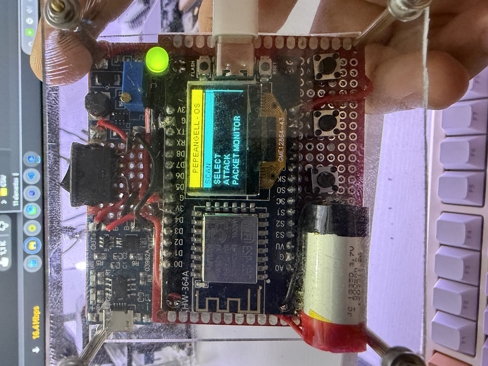

Este firmware convierte el ESP8266 en un equipo de laboratorio con dos formas de control:

- **Dashboard web:** control principal desde el navegador.
- **Pantalla integrada + botones:** navegacion local basica desde el dispositivo.

La interfaz web vive embebida dentro del firmware, por lo que no depende de cargar archivos externos en LittleFS para mostrar el dashboard personalizado.

[Volver al indice](#indice)

<a id="caracteristicas"></a>

## Caracteristicas

- Firmware para ESP8266 / NodeMCU basado en Arduino.
- Punto de acceso propio para administrar el dispositivo.
- Dashboard web embebido en memoria del firmware.
- Interfaz oscura con acentos verdes y naranjas.
- Pantalla OLED SSD1306 integrada.
- Control local con tres botones fisicos.
- Escaneo de puntos de acceso y clientes visibles.
- Administracion de SSID para pruebas beacon/probe en laboratorio.
- Panel de control para pruebas WiFi autorizadas.
- Configuracion persistente en EEPROM.
- Archivos web comprimidos y embebidos en `webfiles.h`.
- Version personalizada: `2.0.0`.

[Volver al indice](#indice)

<a id="acceso-al-dashboard"></a>

## Acceso al Dashboard

Al encender el dispositivo, se crea un AP para administrar el firmware.

| Dato | Valor |
| --- | --- |
| AP | `PepeAngell-DEAUTH` |
| Password | `123456789` |
| IP web | `http://192.168.4.2` |
| Version | `2.0.0` |
| Web URL interna | `pepeangell.dev` |
| Idioma web | Espanol |

El firmware fuerza la IP del AP y la interfaz web a `192.168.4.2`, incluso si existia una configuracion anterior guardada en EEPROM.

[Volver al indice](#indice)

<a id="pines-y-conexiones"></a>

## Pines y Conexiones

La pantalla OLED esta integrada en el dispositivo, por lo que no requiere cableado externo adicional. Aun asi, el firmware la declara como una pantalla `SSD1306_I2C` para que el controlador sepa como comunicarse con ella.

### Pantalla OLED Integrada

| Elemento | Valor en firmware | Nota |
| --- | --- | --- |
| Tipo | `SSD1306_I2C` | Pantalla OLED integrada |
| Direccion I2C | `0x3C` | Direccion usada por el display |
| SDA | `GPIO14` | Linea I2C configurada en firmware |
| SCL | `GPIO12` | Linea I2C configurada en firmware |
| Orientacion | `FLIP_DIPLAY true` | Pantalla invertida segun montaje |
| Texto | `PepeAngell` | Identidad en pantalla |

### Botones Fisicos

| Funcion | Macro | GPIO | Uso |
| --- | --- | --- | --- |
| Arriba | `BUTTON_UP` | `GPIO14` | Navegar hacia arriba en el menu |
| Abajo | `BUTTON_DOWN` | `GPIO12` | Navegar hacia abajo en el menu |
| Seleccionar | `BUTTON_A` | `GPIO13` | Confirmar / entrar / ejecutar accion |

### Reset

| Funcion | Macro | GPIO | Uso |
| --- | --- | --- | --- |
| Reset | `RESET_BUTTON` | `GPIO5` | Reinicio/formato segun flujo del firmware |

> Nota: esta tabla documenta la configuracion activa en `A_config.h` bajo `DISPLAY_EXAMPLE_I2C`. Si se cambia el modelo de placa o preset, estos pines pueden variar.

[Volver al indice](#indice)

<a id="galeria-del-dashboard"></a>

## Galeria del Dashboard

### Aviso de Uso

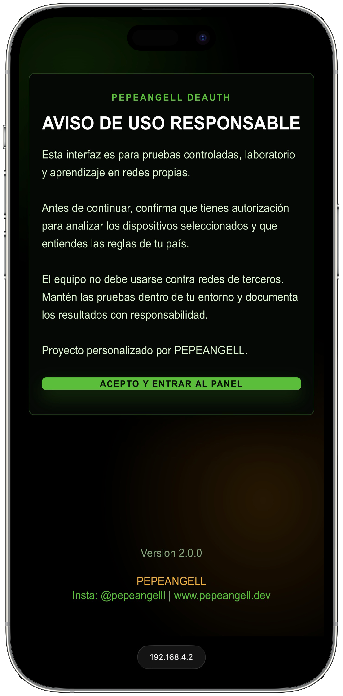

### Escaner

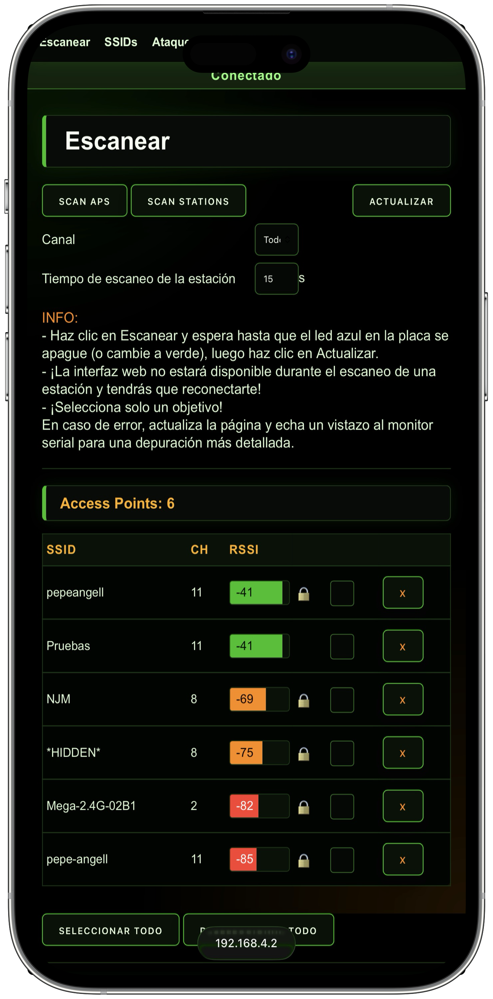

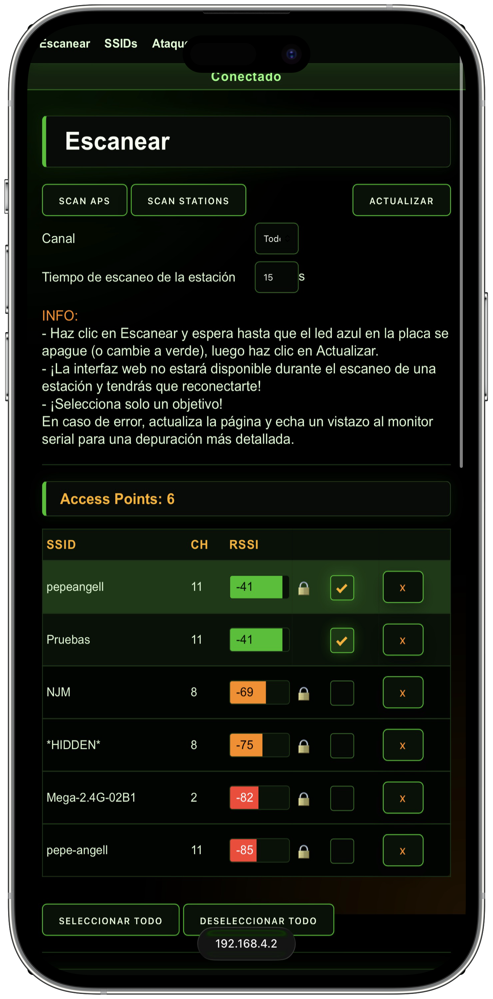

### Clientes Detectados

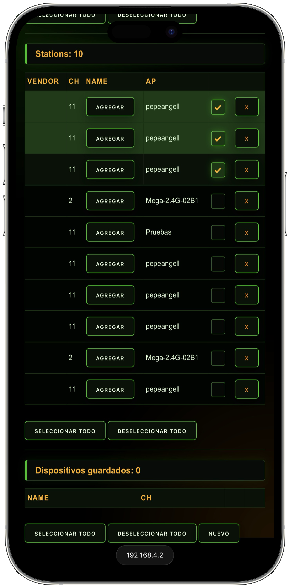

### SSID / Beacons

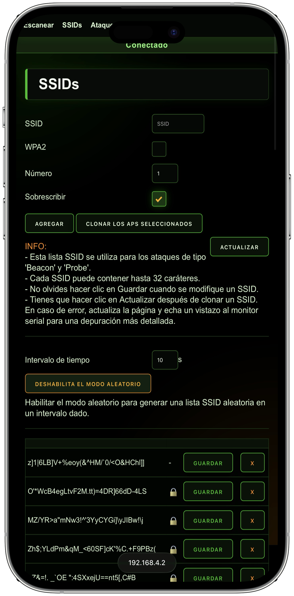

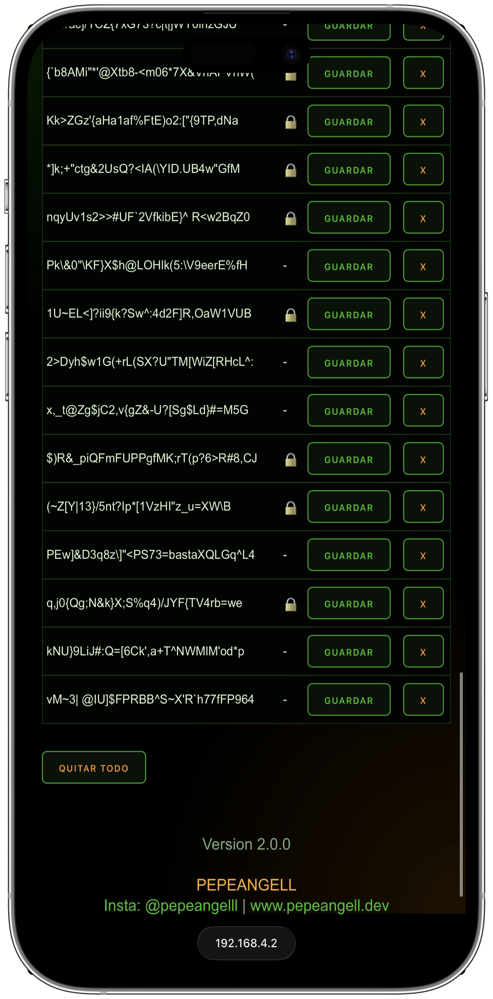

### Panel de Pruebas

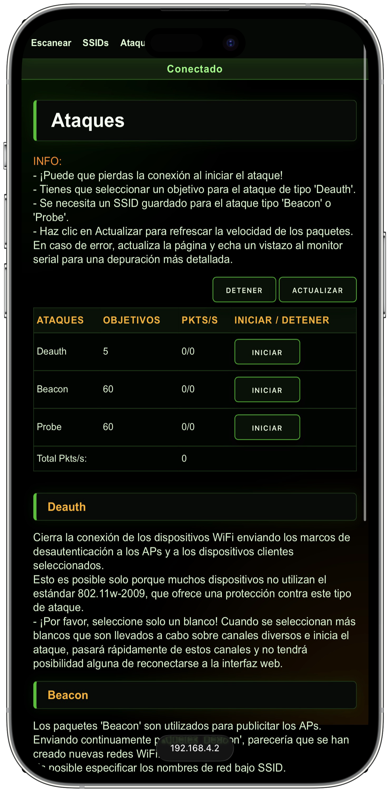

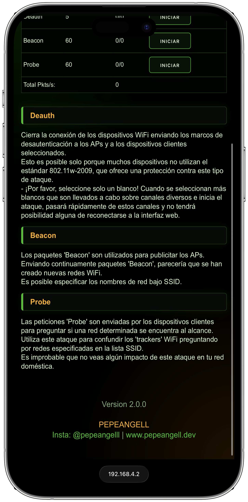

### Configuracion

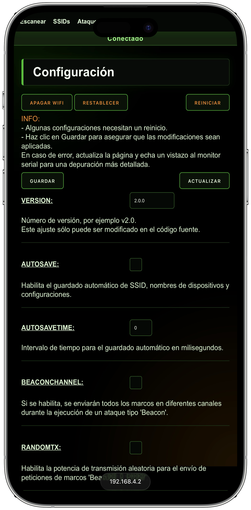

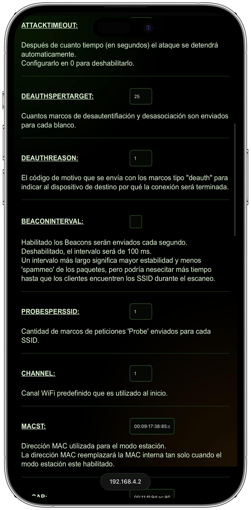

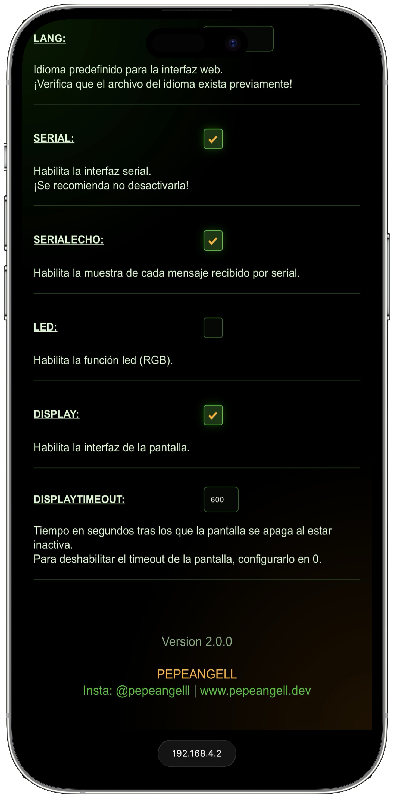

[Volver al indice](#indice)

<a id="flujo-de-funcionamiento"></a>

## Flujo de Funcionamiento

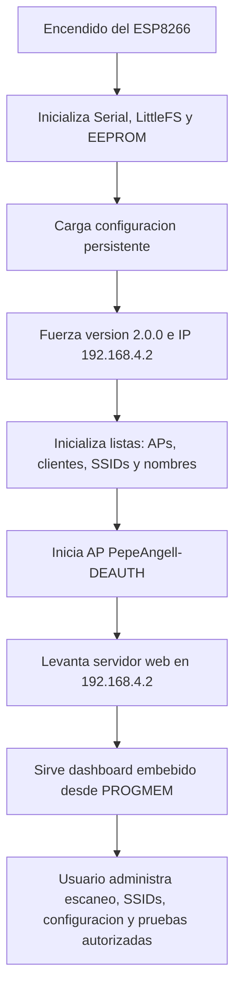

El flujo interno prioriza que el dashboard nuevo siempre salga desde PROGMEM. Esto evita que archivos antiguos en LittleFS vuelvan a mostrar una interfaz previa.

[Volver al indice](#indice)

<a id="modulos-principales-del-firmware"></a>

## Modulos Principales del Firmware

| Archivo | Funcion |
| --- | --- |
| `ESP8266_Deauther_SSD1306.ino` | Punto de entrada del firmware, inicializacion general y ciclo principal. |
| `A_config.h` | Configuracion base: AP, password, IP, pantalla, botones, version y opciones del firmware. |
| `wifi.cpp` / `wifi.h` | AP, DNS, servidor web, rutas HTTP y entrega del dashboard embebido. |
| `settings.cpp` / `settings.h` | Carga, guardado y normalizacion de configuracion persistente. |
| `Scan.cpp` / `Scan.h` | Escaneo de puntos de acceso y clientes. |
| `Accesspoints.*` | Modelo/lista de puntos de acceso detectados. |
| `Stations.*` | Modelo/lista de clientes detectados. |
| `SSIDs.*` | Lista de SSID personalizados para pruebas controladas. |
| `Attack.*` | Control interno de pruebas WiFi autorizadas. |
| `DisplayUI.*` | Menu local en pantalla OLED integrada. |
| `CLI.*` | Interfaz de comandos por serial/web. |
| `webfiles.h` | HTML, CSS, JS e idiomas comprimidos y embebidos en el firmware. |
| `data/web/` | Fuentes web comprimidas que se usan para regenerar `webfiles.h`. |

[Volver al indice](#indice)

<a id="dashboard-web"></a>

## Dashboard Web

El dashboard esta dividido en secciones principales:

| Seccion | Funcion |
| --- | --- |
| Aviso de uso | Pantalla inicial con confirmacion antes de entrar al panel. |
| Scan | Escaneo de APs y clientes visibles en el entorno de pruebas. |
| SSIDs | Administracion de nombres SSID para escenarios controlados. |
| Attack | Panel de estado para pruebas WiFi autorizadas y monitoreo de paquetes. |
| Settings | Configuracion del AP, parametros internos, idioma, pantalla y opciones persistentes. |

La interfaz fue modificada para cargar en espanol, usar fondo negro, botones verdes/naranjas, checks de alto contraste y footer personalizado con redes PEPEANGELL.

[Volver al indice](#indice)

<a id="detalles-tecnicos-de-la-web"></a>

## Detalles Tecnicos de la Web

- Los archivos web viven en `data/web/`.
- Los archivos se almacenan comprimidos como `.gz`.
- `webfiles.h` contiene los mismos archivos como arreglos PROGMEM.
- El firmware sirve la web nueva desde PROGMEM para evitar que LittleFS muestre versiones anteriores.
- Las rutas `/web/*.html`, `/web/*.css` y `/web/js/*.js` se interceptan para servir la interfaz nueva.
- Las cabeceras HTTP usan `no-cache` para evitar que el navegador conserve la interfaz vieja.

[Volver al indice](#indice)

<a id="web-flasher"></a>

## Web Flasher

El proyecto incluye una pagina de flasheo web para instalar el firmware desde el navegador usando Web Serial. Esta pagina esta pensada para publicarse por GitHub Pages, ya que Web Serial requiere HTTPS en Chrome o Edge.

| Recurso | Ruta |
| --- | --- |
| Pagina flasher | `webflasher/index.html` |
| Manifest ESP Web Tools | `binarios/manifest.json` |
| Binario firmware | `binarios/ESP8266-DEAUTHER-PEPEANGELL-v2.0.0.bin` |
| Version publicada | `2.0.0` |
| Chip objetivo | `ESP8266` |
| SHA256 del binario | `8036ED6E3658A0AFEDF2C37CA7A2C7E84E1A5396C403766CB48EF0F8E900A14A` |

Cuando GitHub Pages este activo, el flasher queda disponible en:

```text
https://pepeangell5.github.io/ESP8266-DEAUTHER/webflasher/
```

Flujo recomendado:

1. Abrir el Web Flasher desde Chrome o Edge.
2. Conectar el ESP8266 por USB con un cable de datos.
3. Presionar `Conectar e instalar`.
4. Seleccionar el puerto serial del ESP8266.
5. Esperar a que termine el flasheo y reinicie el dispositivo.
6. Conectarse al AP `PepeAngell-DEAUTH`.
7. Entrar al dashboard en `http://192.168.4.2`.

Si la placa no entra automaticamente en modo bootloader, mantener presionado el boton `FLASH`/`BOOT` al conectar o reiniciar el ESP8266.

[Volver al indice](#indice)

<a id="compilacion"></a>

## Compilacion

Este proyecto usa PlatformIO.

```bash
pio run
```

El binario publicado para el Web Flasher se guarda en:

```text
binarios/ESP8266-DEAUTHER-PEPEANGELL-v2.0.0.bin
```

Para subir al ESP8266, ajusta el puerto serial segun tu equipo:

```bash
pio run -t upload --upload-port COM7
```

Configuracion actual de PlatformIO:

```ini
[env:nodemcuv2]
platform = espressif8266@2.6.3
board = nodemcuv2
framework = arduino
monitor_speed = 115200
upload_speed = 115200
lib_ldf_mode = deep+
```

> Si compilas en otra computadora, revisa `platformio.ini`, especialmente la ruta de `platform_packages`, porque puede depender de la instalacion local del core ESP8266.

[Volver al indice](#indice)

<a id="hardware-objetivo"></a>

## Hardware Objetivo

- ESP8266 / NodeMCU ESP-12E.
- Pantalla OLED SSD1306 integrada.
- Tres botones fisicos: arriba, abajo y seleccionar.
- Firmware configurado con texto de pantalla `PepeAngell`.
- Comunicacion serial a `115200`.

[Volver al indice](#indice)

<a id="uso-responsable"></a>

## Uso Responsable

Este firmware debe usarse solamente en:

- Redes propias.
- Laboratorios controlados.
- Ambientes academicos.
- Pruebas con autorizacion explicita.

No uses este proyecto para afectar redes de terceros, interrumpir comunicaciones ajenas o realizar pruebas fuera de un entorno permitido.

[Volver al indice](#indice)

<a id="repositorio"></a>

## Repositorio

Repositorio del proyecto:

[github.com/pepeangell5/ESP8266-DEAUTHER](https://github.com/pepeangell5/ESP8266-DEAUTHER)

[Volver al indice](#indice)

<a id="autor-y-redes"></a>

## Autor y Redes

PEPEANGELL

- Instagram: [@pepeangelll](https://www.instagram.com/pepeangelll)
- Web: [www.pepeangell.dev](https://www.pepeangell.dev)

[Volver al indice](#indice)
